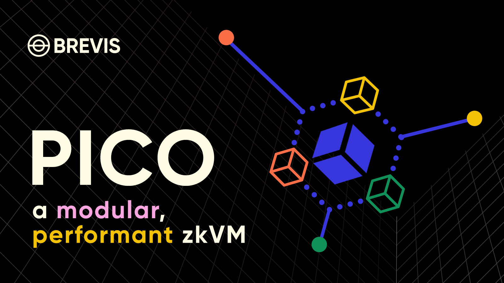

# Pico

Pico is an open-source zero-knowledge virtual machine (zkVM) that transforms how developers build secure, scalable, and high-performance decentralized applications. Drawing on the innovative [Glue-and-Coprocessor](https://vitalik.eth.limo/general/2024/09/02/gluecp.html) architecture, Pico fuses the efficiency of specialized circuits with the adaptability of a general-purpose zkVM. This unique design empowers you to craft tailored proof systems that meet the diverse needs of your applications.

**[Install](https://pico-docs.brevis.network/getting-started/installation)**
| [Docs](https://pico-docs.brevis.network/)
| [Examples](https://github.com/brevis-network/pico/tree/main/examples)
| [Telegram](https://t.me/brevisnetwork)
| [Discord](https://discord.com/invite/QTRkjKdZ6A)

## Getting Started

Before you begin, please ensure that you have installed all the [requirements](./docs/requirements.md). For installation and setup instructions, refer to the [Installation Guide](https://pico-docs.brevis.network/getting-started/installation) and follow the steps outlined in [Quick Start](https://pico-docs.brevis.network/getting-started/quick-start) section in [Pico Docs](https://pico-docs.brevis.network/).

## Key Features
Pico’s design is rooted in the need for adaptable, high-performance ZK systems that can keep up with the rapidly evolving cryptography research. Rather than relying on a "one size fits all" solution, Pico’s modular architecture lets you:

- **Leverage Interchangeable Proving Backends**: Select from multiple proving backends to achieve the best performance and efficiency. 
- **Integrate App-Specific Circuits**: Seamlessly incorporate specialized circuit/coprocessors to accelerate domain-specific computations. 
- **Customize Proving Workflows**: Assemble and fine-tune proof generation pipelines tailored to your application’s specific requirements. 

## Supported Proving Backends
One of Pico’s most innovative features is its ability to seamlessly switch between multiple proving backends.
Currently, Pico supports generating proofs in [all phases](https://pico-docs.brevis.network/writing-apps/advanced/proverchain) — RISCV, CONVERT (RECURSION), COMBINE (RECURSION), COMPRESS (RECURSION) 
and ONCHAIN (for EVM) — with both STARK on KoalaBear and STARK on BabyBear.
For CircleSTARK on Mersenne31, Pico currently supports the RISCV-Phase, with RECURSION and EVM phases coming soon.

- STARK on KoalaBear (prime field $p = 2^{31} - 2^{24} + 1$): Supports generating proofs for
  - [x] RISCV-Phase
  - [x] RECURSION-Phase
  - [x] EVM-Phase
- STARK on BabyBear (prime field $p = 2^{31} - 2^{27} + 1$): Supports generating proofs for
  - [x] RISCV-Phase
  - [x] RECURSION-Phase
  - [x] EVM-Phase
- CircleSTARK on Mersenne31 where $p = 2^{31} - 1$). Supports generating proofs for
  - [x] RISCV-Phase
  - [ ] RECURSION-Phase
  - [ ] EVM-Phase

## Security
As of February 2025, Pico has not been audited and is not recommended for production use. 

## For Contributors

We welcome contributions from developers, researchers, and enthusiasts. Whether you’re fixing bugs, enhancing performance, improving documentation, or adding new features, your input is crucial for Pico’s evolution.

Before getting started, please review our [Repo Layout](./docs/layout.md) to understand the repository structure. For detailed contribution instructions, see our [Contributing Guidelines](./docs/contributor.md).

## Acknowledgements

Pico draws inspiration from the following projects, each representing cutting-edge advancements in zero-knowledge proof systems. 
- [Plonky3](https://github.com/Plonky3/Plonky3): Pico’s proving backend is based on Plonky3, extending its modularity to the zkVM layer to enable the flexible selection of proving fields and systems that best fit each use case.
- [SP1](https://github.com/succinctlabs/sp1): Pico derives significant inspiration from SP1’s chip design and their constraints. Its recursion compiler and precompiles originate from SP1.
- [Valida](https://github.com/valida-xyz/valida): Pico’s implementation of cross-table lookups is inspired by Valida’s pioneering work in this area.
- [RISC0](https://github.com/risc0/risc0): Pico’s Rust toolchain is based on the one originally developed by RISC0.

